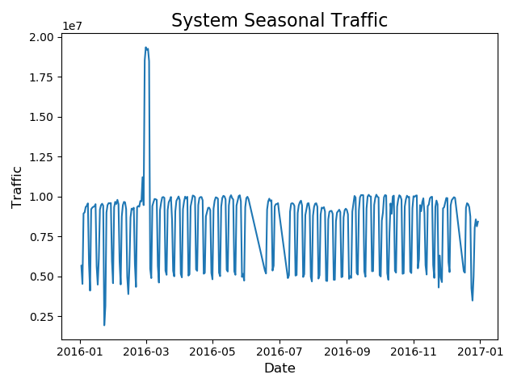
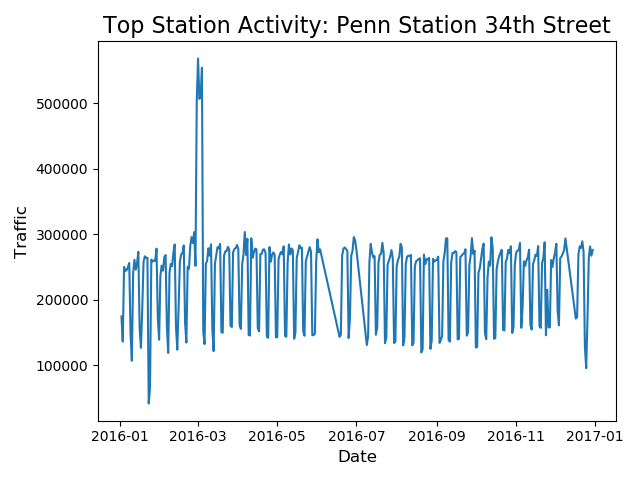
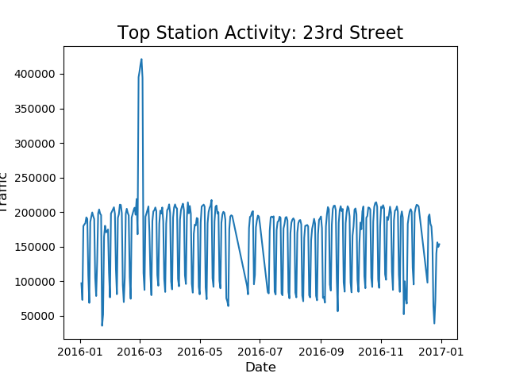
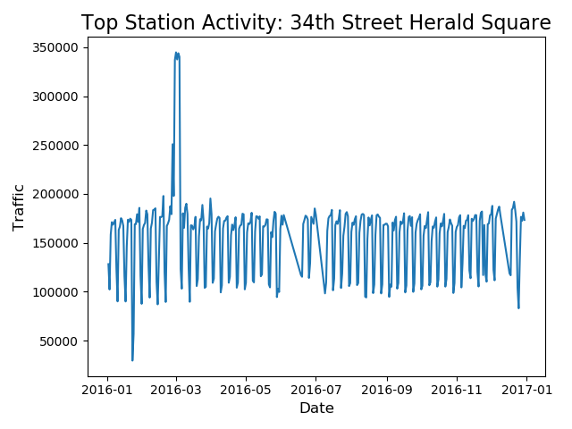
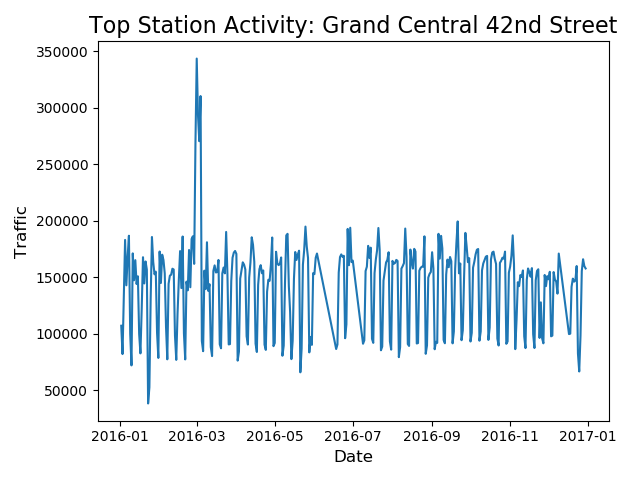
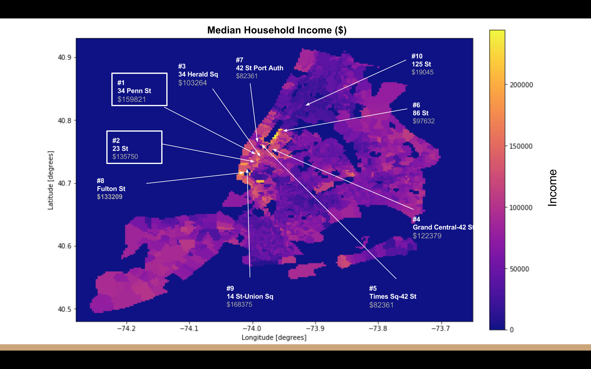
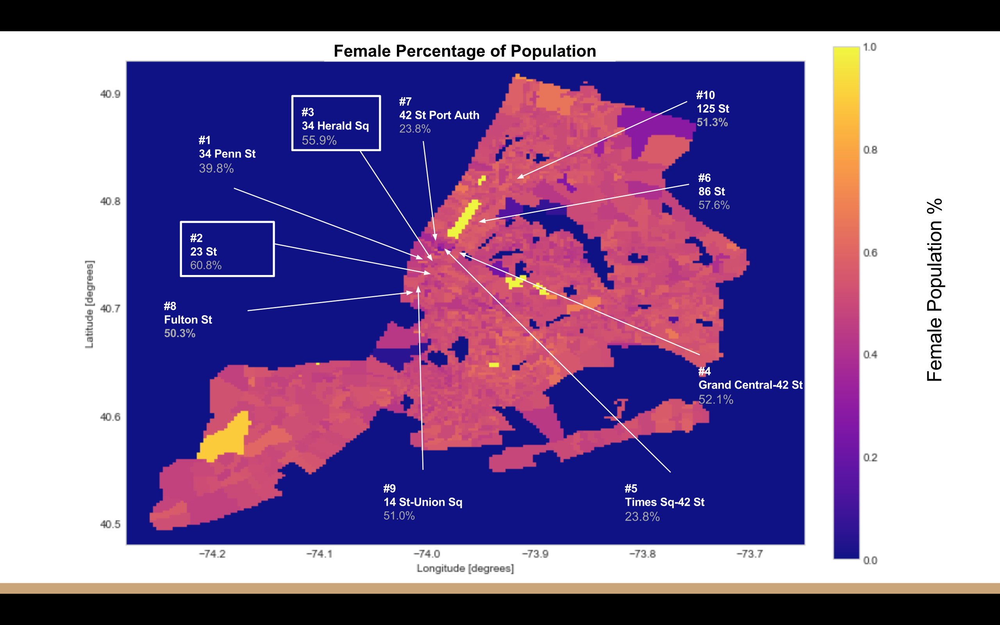
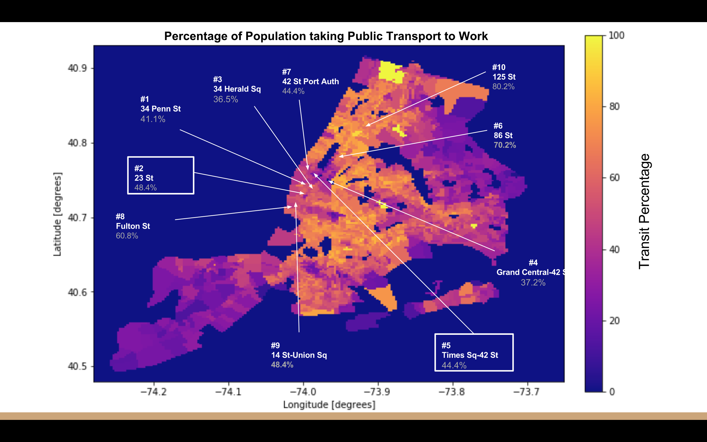
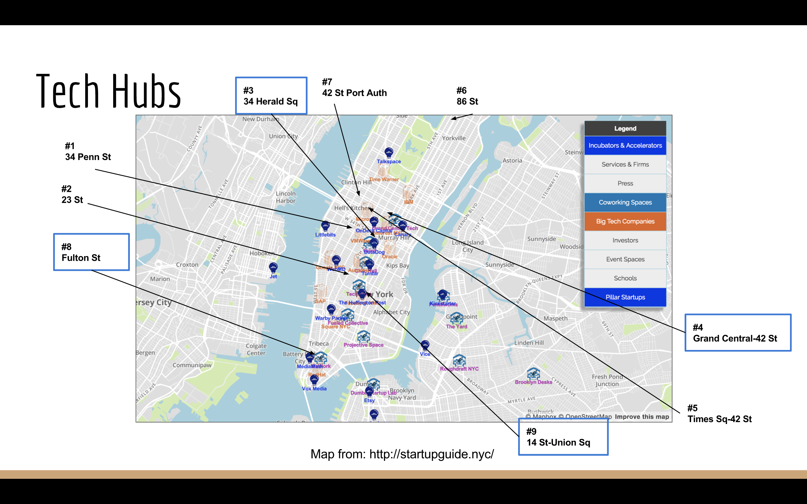

# Analyzing NYC MTA subway and demographic data to optimize street team deployment
19 January 2018

### Problem Statement

At the request of Women Tech Women Yes (WTWY), an NYC-based non-profit focused on promoting women in tech,
our team has been tasked with optimizing the deployment of WTWY street teams to subway stations to raise
awareness of an upcoming summer gala that WTWY would like to promote. Street team deployment optimization
is to be done via analysis of NYC MTA subway traffic data as well as demographic data on the population in
proximity to these stations.  

### Summary
During the four days of the first week (due to MLK Jr. Day) of Metis' Winter Data Science Bootcamp 2018, we were tasked with optimizing deployment of a street team to raise awareness of a summer gala for Women Tech Women Yes (WTWY) in New York City.

We assumed a modest street team head count, and thus set out to identify the top NYC subway stations which demonstrated both high traffic and favorable demographics.

Our approach was to analyze two sets of data, consisting of:
- MLA Turnstile data from [data.ny.gov](https://data.ny.gov/Transportation/Turnstile-Usage-Data-2016/ekwu-khcy); and
- Demographic data, which was an aggregatation of data from:
--  the [U.S. Census Bureau](https://factfinder.census.gov/faces/nav/jsf/pages/index.xhtml);
--  the [Federal Communications Commission](https://www.fcc.gov/general/census-block-conversions-api); and
--  inspired by MuonNeutrino's post on [Mapping New York City Census Data](https://www.kaggle.com/muonneutrino/mapping-new-york-city-census-data/data) on Kaggle.com.

### Approach
The complete Jupyter Notebook, including both MTA subway and demographic data analyses, can be found [here](https://github.com/cipher813/McMahon_Metis/blob/master/Project_1/P1_MTA.ipynb).  

#### MTA Approach
Our approach to the MTA Subway Data analysis was as follows:
1. **Import data.** We used full calendar year 2016 turnstile data from [data.ny.gov](https://data.ny.gov/Transportation/Turnstile-Usage-Data-2016/ekwu-khcy).  
2. **Clean data.** Extra spaces were parsed, unnecessary columns were removed, etc.  
3. **Adjust turnstile data for daily increments.** The turnstile data consisted of rolling totals for each individual turnstile.  We thus adjusted by taking the daily incremental ticks of each machine on a daily basis.  
4. **Filter outliers (ie > 99% quantile).** If a turnstile broke down or was reset, the rolling total would be affected.  We adjusted for large irregular values by filtering any number greater than the 99% quantile.  
5. **Sort by traffic.** Traffic aggregated by station was sorted to determine the busiest stations.  Traffic is a metric for general activity, calculated as the sum of entries and exits for each turnstile.  
6. **Plot time series of busiest stations.** The top five stations were further analyzed by plotting the full year time series for each.  

#### High Traffic MTA Subway Station Locations
Our results shows that the top MTA subway stations generally had the following characteristics:
- central Manhattan
- multiline subway hubs

The top 20 stations by traffic is as follows:

System traffic:

As you can see, the top 5 stations consist of:
1. Penn Station
2. 23rd Street
3. Herald Square
4. Times Square
5. Grand Central

With a quick comparison to online data, such as at [web.mta.info](http://web.mta.info/nyct/facts/ffsubway.htm), we are fairly comfortable with these results. However, as this was a project completed from start to finish in less than four days, we have a list of items to follow up on at a later time.  One of these would be to further refine the filtering of outliers from these results.  For instance, there is a spike in March in all of the above charts which we would like to investigate further.  

Diving deeper into these stations:

Penn Station claimed the top spot in terms of heaviest traffic in a single station.  As you can see, its weekly traffic is quite consistent.  

23rd Street was the second busiest in our investigation.  Also a central location within Manhattan.  

Herald Square claimed the third spot in our analysis, another central Manhattan hub.  

Times Square, per our analysis, is the fourth busiest subway station in the NYC metro area.  

Grand Central Station, another important central Manhattan hub, was the fifth-busiest in our analysis.  

As you can see, on a full system basis all usage patterns are quite similar and consistent. This is likely due to the fact that these are the top stations by usage and as such capacity is more or less consistently reached on a daily basis.  We can clearly see the weekly dip on the weekends, and a large spike in March which should be investigated further.  

Once we had mapped out the top stations, we then took a dive into the demographic data for each top station to confirm that demographics were favorable for each.  

### Favorable Demographic Findings
Using the [American Community Survey data](https://www.kaggle.com/muonneutrino/mapping-new-york-city-census-data/data) as compiled by MuonNeutrino on Kaggle, analyzed demographics of busiest stations.  We then combined census location data from the [U.S. Census Bureau](https://factfinder.census.gov/faces/nav/jsf/pages/index.xhtml).
We zoomed in on the highest traffic stations and close proximity to analyze average demographics
utilizing MuonNeutrino's mapping functionality to map demographics.

We determined the following characteristics to make up the target profile for the street teams to focus on as they are deployed in the selected subway stations to raise awareness of the WTWY gala:
1. High income
2. High female population
3. High % use the NYC Subway
4. Business / tech hubs

Demographic data for the NYC metro area, mapped to the identified high-traffic stations, is as follows:

Income tends to be high in central Manhattan, including within proximity to our busiest five NYC metro subway stations.  

NYC metro, and especially Manhattan, boasts a majority (>50%) female population.  

Public transportation usage, such as use of the subway, is popular in central Manhattan.  

Central Manhattan is an important technology and business hub.  

In summary, we confirmed that each of the top five stations by traffic were primarily utilized by favorable demographics, with points of note as follows:

**High Traffic Stations**   **Demographic Highlights**
Penn Station, 34th St       High median household income ($159,821)
Herald Square, 34th St      Near tech hubs
Times Square, 42nd St       High transit percentage (37.2%)
Grand Central, 42nd St      Near tech hubs
23rd St                     High female population (60.7%), income ($135,750) and transit percentage (48.4%)

## Conclusion
Fortunately for WTWY's ambitions, NYC's easy to access traffic hubs also exhibit favorable demographics: high income, tech/business savvy and >50% female.  

It is recommended to focus the WTWY's street team efforts on key central hubs of Manhattan:
1. Penn Station
2. Herald Square
3. Times Square
4. Grand Central
5. 23rd Street

## Next Steps
There are a few more pieces of analysis that we would like to incorporate upon additional time allocation to the project.  These include:
- further iron out any outliers
- analyze data for specific temporal trends (such as weekday vs weekend traffic, and traffic by time of day)
- demographic "scorecard" for each station, where each demographic feature is weighted within a comprehensive analysis of each station  

The original presentation slides are available [here](https://github.com/cipher813/McMahon_Metis/blob/master/Project_1/WTWY%20Street%20Team%20Deployment%20Analysis.pdf).
