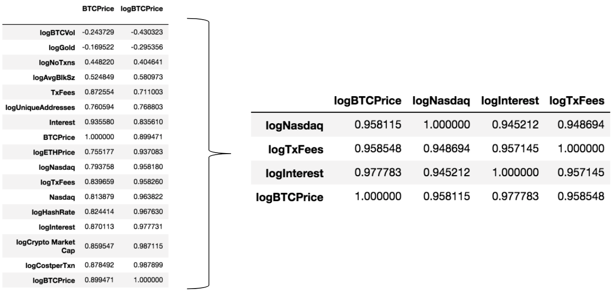
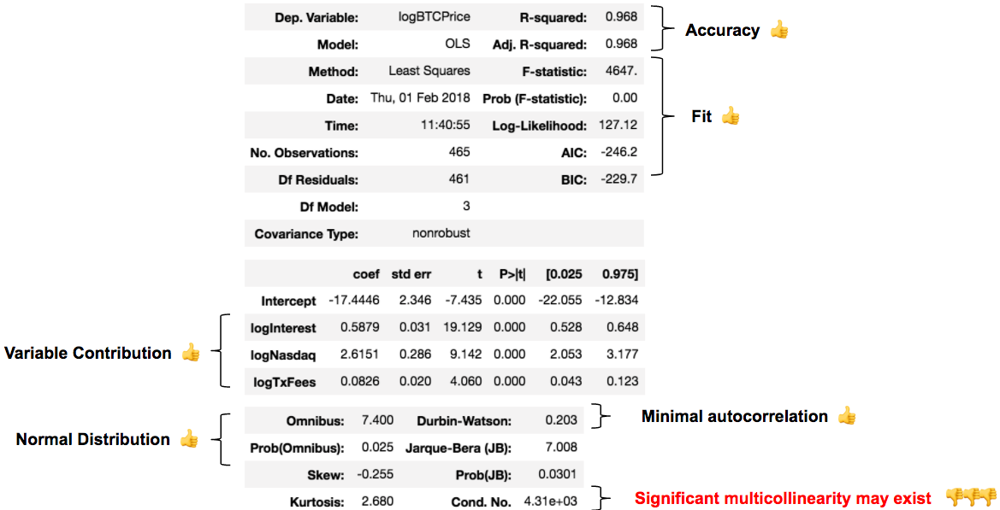
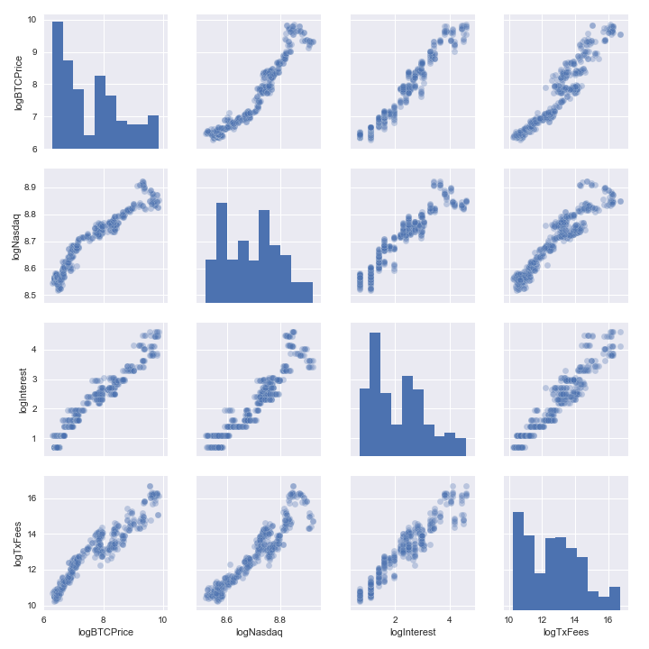
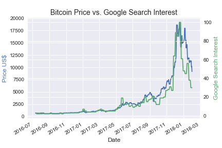
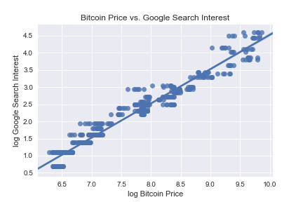
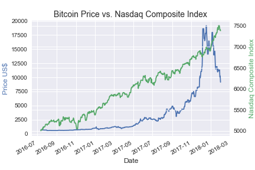
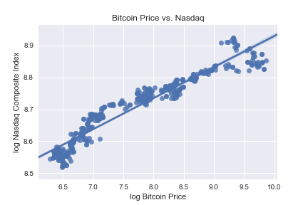
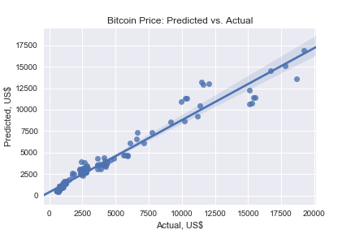

# Bitcoin Linear Regression: Correlation Exploration
2 February 2018

As you may know, Bitcoin is a decentralized digital currency notorious for extreme price volatility.  To tame this beast, I set out to build a multivariable linear regression model which can be used to predict the price of Bitcoin.  In this post, I will:

1. Introduce a predictive model for the price of Bitcoin
2. Explore a couple significant underlying features of the model
3. Provide my key insights and takeaways from this project

### Model Overview
The model is a standard, multivariable linear regression model. The project scope required standard linear regression rather than a time series analysis; I hope to reconfigure this model into a time series analysis at a later time.  The difference primarily relates to whether the train-test split is shuffled or sequential - this will be discussed later in this post.  

The model has identified three key features (independent variables) which are highly correlated with the price of Bitcoin (dependent variable).  Regularization was evaluated but deemed not necessary
given the already high correlation, resulting in an R2 accuracy of 96.8%.

### Feature Exploration
The goal here is to target features that have a high correlation to Bitcoin, but aren't necessarily too close to the direct price movement of Bitcoin (an example of this would be
  cryptocurrency universe market capitalization, of which the Bitcoin market capitalization represents ~30%).  Features considered include:

Bitcoin related:
- Cryptocurrency universe market capitalization
- Ethereum price
- Volume
- Number of transactions
- Average block size
- Transaction fees
- Unique addresses
- Hash rate

Market related:
- Price of Gold
- Nasdaq Composite Index

Other:
- Google search interest
- Social media sentiment analysis (via Twitter)

Most of these features were also transformed onto a natural log scale as they relate exponentially / multiplicatively, so this transformation allows a more linear, "apples to apples" relationship on this basis.  

From this set of features, I was able to narrow down to the following for use in the model:
1. log of Google search interest
2. log of Nasdaq Composite Index
3. log of Bitcoin network transaction fees

With only three features, the model achieves high correlation and accuracy with an R2 of ~97%.  Taking a look at the diagnostic below, it appears that all major statistical tests largely check out with the exception of Condition Number which signals multicollinearity, which simply means significant correlation amongst the independent variables.  This isn't necessarily a significant issue, and can be addressed by removing features (although 3 is already a small number of features).  The real issue would be if there were perfect multicollinearity amongst any two independent variables.  Fortunately, each of the three variables represents metrics relatively distant from each other.  By this I mean it would be highly unlikely for google search metrics to perfectly track Nasdaq, nor for Nasdaq to perfectly track Bitcoin network transaction fees.  

In the chart below we see the linear relationships of the three independent variables against the log Bitcoin price dependent variable.  However, this chart also serves as prime evidence of multicollinearity as discussed above.  

I will now dive into some of the key features of the model to see what insights we may uncover.   

The most interesting relationship in this analysis would arguable be the high correlation between the price of Bitcoin and its search popularity on google.  

As you can see, the two metrics closely track each other.  The google search metric may even potentially be a promising leading indicator.  This merits continued observation.  

Below we also see the single feature regression of the log of google search interest against the log of the Bitcoin price - again depicting a strong linear relationship.  

Another interesting feature of the prediction model is the Nasdaq Composite Index.  The correlation is high for both metrics.  However, I would caveat this relationship by saying that Bitcoin has been in existence for nine years.  Those entire nine years, the Nasdaq has been on a "bull run".  Only time will tell how any bearish trends affecting the Nasdaq will affect the price of Bitcoin.  

And once again we note a strong linear relationship between the log of the Nasdaq and the log of Bitcoin.  

And now we look at the three feature model as a whole, noting strong correlation between the log linear relationship of the model and the log of the price of Bitcoin.   

")

Adjusting for the log, we now see the predictive price results of our model.  The below chart maps the model's prediction for the price of Bitcoin against actual results from our test sample.  

To interpret this, you would essentially feed the metrics of the three features into the model, and it will then provide a prediction of the price of Bitcoin.  

### Key Insights / Takeaways
In this analysis, the price of Bitcoin has been found to be a function of:
1. Google search interest
2. Nasdaq Composite Index
3. Bitcoin network transaction fees  

Google search interest closely tracks the price of Bitcoin and may even be a prime candidate as a leading indicator of the digital currency.  

Nasdaq is also historically correlated with the price of Bitcoin; however, we will want to keep watching this relationship after Nasdaq experiences bearish trends / downside pressure upon the stock market index.

### Next Steps
There are several areas in which this analysis could be further improved.  Most importantly, I plan to reconfigure this model as a time series analysis complete with a price prediction over a certain time window.  The key difference in the model would be to use non-randomized data when determining the train/test split.  The model would be trained on the earliest historical data in the set and tested on the most recent few months. This model could then proceed to extrapolate the predicted price of Bitcoin over a period of time, such as the following month, quarter or even year.  

I would also like to incorporate a mechanism to gauge sentiment analysis derived from Twitter against the price of Bitcoin over a period of time.  I had sought to include this component into the existing model, but was only able to gather real-time data and could not identify sufficient compelling insights due to the short period of time collected (~ 1 week) due primarily to noise within the data.  To collect this information the Twitter API, and TextBlob for sentiment analysis of each tweet, was utilized.

__My full set of presentation slides, including appendices, are available [here](https://github.com/cipher813/McMahon_Metis/blob/master/Project_2/20180202_Bitcoin_LR_Presentation.pdf).  I welcome any questions or comments at cipher813@gmail.com.__
